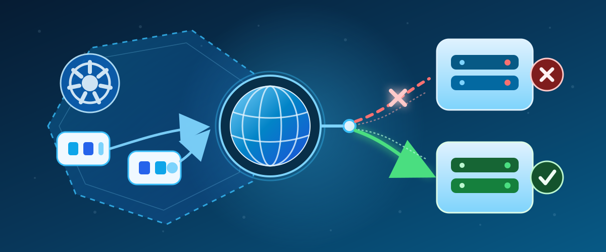

# AKS CoreDNS behavior and validation

This directory explains CoreDNS behavior in Azure Kubernetes Service (AKS): upstream selection, timeouts, failover, active health checks, application impact, and persistence of supported custom DNS configuration. It combines technical responses, repeatable test procedures, reusable lab assets, and retained evidence from `aks01day2`.

This is documentation and test-lab material, not a production DNS deployment package. CoreDNS capabilities, AKS-supported customization, and behavior established by a particular test are distinguished throughout.

## Contents

- [Responses](#responses)
- [Validation asset index](#validation-asset-index)
- [Retained validation results](#retained-validation-results)
- [Running validation safely](#running-validation-safely)
- [Blog and publication assets](#blog-and-publication-assets)
- [Interpreting and maintaining the evidence](#interpreting-and-maintaining-the-evidence)

## Responses

Each response contains the answer, supporting explanation, items to validate, dedicated test cases, expected results, established evidence, and limitations.

| Response | What it covers | Test family |
| --- | --- | --- |
| [01 - Selection policy and custom configuration persistence](responses/01-Selection-policy.md) | Random, round-robin, and sequential upstream selection; eligibility and caching; the AKS customization boundary; `EnsureExists` versus `Reconcile`; persistence across observation, a control-plane upgrade, and CoreDNS pod replacement. | SP, including SP-14 through SP-16 for persistence |
| [02 - Timeout before trying another upstream](responses/02-Timeout-before-next-upstream.md) | Dial and read timeouts, UDP versus TCP, packet loss versus refusal, connection history, client timeouts, and version-specific behavior. | TV |
| [03 - Failover mechanism](responses/03-Failover-mechanism.md) | Request-level fallback, DNS response codes, learned upstream health, recovery, all-upstreams-unavailable behavior, and how selection policy affects failover. | FM |
| [04 - Active health checks](responses/04-Active-health-checks.md) | Error-triggered health checks, probe behavior, `max_fails`, upstream eligibility, recovery, and metrics. Packet-level limitations are stated separately. | HC |
| [05 - Application and user impact](responses/05-Application-and-user-impact.md) | Lookup latency and errors, client retries, caching, connection reuse, and the application telemetry needed to establish workload or SLO impact. | IMP |

## Validation asset index

The [validation directory](validation/) contains **five PowerShell files and two YAML manifests**, listed below. Its [results subdirectory](validation/results/) contains the **19 retained result files** indexed in the next section.

| Asset | Purpose and operating scope |
| --- | --- |
| [coredns-failover-lab.yaml](validation/coredns-failover-lab.yaml) | Base namespace, ConfigMaps, Services, and six Deployments: two synthetic upstreams, three resolver variants, and a DNS client. The upstream answers use documentation addresses `192.0.2.10` and `192.0.2.20`. The lab CoreDNS image is pinned to `v1.13.1-20`. |
| [Deploy-CoreDNSFailoverLab.ps1](validation/Deploy-CoreDNSFailoverLab.ps1) | Checks the current context, applies the base manifest, configures resolver upstreams using their Service IPs, restarts the lab resolvers, and waits for readiness. It creates or changes lab resources. |
| [Test-CoreDNSFailover.ps1](validation/Test-CoreDNSFailover.ps1) | Original convenience runner for `TC-00` through `TC-09`: managed baseline inspection, policy selection, response-code handling, packet-loss failover, client timeouts, health metrics, and recovery. It temporarily applies the outage policy, restarts the lab sequential resolver, attempts policy removal in `finally`, and writes a Markdown report. It does **not** execute every dedicated case in the five responses. |
| [primary-outage-networkpolicy.yaml](validation/primary-outage-networkpolicy.yaml) | Deliberately denies ingress to the lab primary upstream to simulate packet loss. It targets `coredns-failover-validation`; enforcement depends on the cluster's NetworkPolicy implementation. It is a fault-injection asset, not a healthy baseline policy. |
| [Remove-CoreDNSFailoverLab.ps1](validation/Remove-CoreDNSFailoverLab.ps1) | Deletes the selected validation namespace and everything inside it. Supports PowerShell `ShouldProcess`, including `-WhatIf`. Use only for explicitly approved full teardown, not routine per-case cleanup. |
| [CoreDNSCustomConfig.Helpers.ps1](validation/CoreDNSCustomConfig.Helpers.ps1) | Shared read-only lifecycle helpers: context-qualified `kubectl` execution, complete custom ConfigMap payload hashing, identity/version/availability snapshots, and preservation assertions. Load it for SP-14 and SP-15; SP-16 loads it automatically. |
| [Test-CoreDNSCustomConfigPersistence.ps1](validation/Test-CoreDNSCustomConfigPersistence.ps1) | Standalone SP-16 runner. Requires `-ApproveCustomDnsChange` and a new private evidence directory. Validates a unique rule with the same CoreDNS image, patches only its own custom key, performs activation and persistence restarts, collects 31 snapshots, and removes its key with a third restart and cleanup checks. This test intentionally changes supported custom configuration and restarts managed CoreDNS. |

The response documents also contain case-specific PowerShell procedures and temporary test configurations. Use those dedicated procedures for the mapped SP, TV, FM, HC, or IMP case rather than assuming the original TC runner covers it. SP-15's upgrade requires separate approval; there is no reusable automatic AKS upgrade runner in this directory.

## Retained validation results

### Behavior, timeout, health, and application-impact evidence

| Retained file | Description |
| --- | --- |
| [Original TC suite - 2026-09-23](validation/results/aks01day2-20260923-232149.md) | Historical convenience-runner report: ten tests passed, none failed. This is not a complete run of every later dedicated response suite. |
| [Timeout validation - 2026-09-24](validation/results/aks01day2-timeout-20260924.md) | Sixteen mapped TV cases executed or source-verified, including UDP/TCP timeout characterization, connection history, client timeouts, and parser compatibility. |
| [Failover validation - 2026-09-24](validation/results/aks01day2-failover-20260924.md) | Fourteen mapped FM cases with transport, response-code, health-learning, policy, and recovery evidence. Characterizing a failure response is distinguished from proving successful backup resolution. |
| [Active health-check validation - 2026-09-24](validation/results/aks01day2-health-checks-20260924.md) | HC results, metrics, probe observations, cleanup, and explicit partial or blocked packet-level/recovery claims. |
| [Application-impact validation - 2026-09-24](validation/results/aks01day2-impact-20260924.md) | Earlier DNS-level IMP results and the application-specific checks that could not be established without a representative workload. |
| [Application-impact validation - 2026-09-25](validation/results/aks01day2-impact-20260925.md) | Later readable IMP report with measured DNS behavior, cleanup, and remaining application/runtime/SLO prerequisites. |
| [Application-impact raw evidence - 2026-09-25](validation/results/aks01day2-impact-20260925-102725.json) | Structured measurements backing the September 25 IMP report. |

### Custom configuration lifecycle evidence

The three persistence cases answer different questions:

| Case | Recorded outcome | What was established |
| --- | --- | --- |
| [SP-14 - Observation](responses/01-Selection-policy.md#sp-14-custom-config-observation-observe-custom-configuration-over-time) | **PASS, attempt 2** | Existing custom data, UID, and resourceVersion were unchanged in 31 snapshots over **1,154.510 seconds**, with managed CoreDNS 2/2 Available at every sample. This does not establish a reconciliation interval. |
| [SP-15 - Approved upgrade](responses/01-Selection-policy.md#sp-15-custom-config-upgrade-compare-custom-configuration-across-an-approved-upgrade) | **PARTIAL PASS** | The actual **1.35.7 to 1.36.3 control-plane-only upgrade** completed and preserved custom data, UID, and resourceVersion. Both node pools remained on 1.35.7. The fixed-address DNS assertion was not met: after an initial command-execution failure, the public record returned `NOERROR` with a different IP. Configuration preservation passed; the complete case did not. |
| [SP-16 - One-time patch persistence](responses/01-Selection-policy.md#sp-16-custom-config-patch-persistence-apply-once-and-verify-custom-dns-persistence) | **PASS, attempt 2** | A rule applied once survived another complete CoreDNS pod replacement without reapplication and 31 snapshots over **1,183.785 seconds**. All **31 DNS checks** met their assertions, and cleanup restored the original custom data and UID. |

All lifecycle files below are from **2026-10-02**. Failed and blocked attempts remain visible rather than being overwritten by later success.

| Retained file | Description |
| --- | --- |
| [Initial access-blocked attempt](validation/results/aks01day2-custom-config-20261002.md) | Historical API-access failure before the cluster became reachable. No completed SP-14 observation or SP-15 upgrade was established by this attempt. |
| [SP-14 readable live report](validation/results/aks01day2-custom-config-20261002-live.md) | Both observation attempts, management-label interpretation, and final health. Its earlier SP-15 authorization deferral is explicitly historical and links to the later upgrade result. |
| [SP-14 attempt 1 - raw evidence](validation/results/aks01day2-custom-config-20261002-sp14-attempt1.json) | Failed availability gate after seven snapshots; custom data remained unchanged, but the full observation did not pass. |
| [SP-14 attempt 2 - raw evidence](validation/results/aks01day2-custom-config-20261002-sp14-attempt2.json) | Passing 31-snapshot observation and retained health evidence. |
| [SP-15 readable upgrade report](validation/results/aks01day2-custom-config-20261002-sp15.md) | Completed control-plane upgrade, unchanged custom configuration, DNS test-input limitation, partial-pass interpretation, and final health. |
| [SP-15 operation and first postcheck](validation/results/aks01day2-custom-config-20261002-sp15-upgrade.json) | Before/after snapshots, Azure operation samples and completion, and the first post-upgrade query's API-to-kubelet HTTP 500 execution failure. |
| [SP-15 read-only postcheck retry](validation/results/aks01day2-custom-config-20261002-sp15-postcheck.json) | Preserved configuration and a successful `NOERROR` lookup, but a different public A record failed the unchanged-address assertion. |
| [SP-15 supplemental DNS checks during upgrade](validation/results/aks01day2-custom-config-20261002-sp15-during-upgrade-dns.json) | Primary, secondary, and sequential lab DNS checks plus a configuration snapshot. These do not substitute for the custom-query criterion. |
| [SP-15 final health](validation/results/aks01day2-custom-config-20261002-sp15-final-health.json) | Normal Kubernetes Service DNS, CoreDNS availability, six Available lab Deployments, four Ready nodes, and absence of fault policies and SP-16 syntax resources at the final check. |
| [SP-16 readable patch-persistence report](validation/results/aks01day2-custom-config-20261002-sp16.md) | One-time patch, same-image syntax preflight, pod replacement, observation, DNS checks, cleanup, and the earlier failed attempt. |
| [SP-16 attempt 1 - raw evidence](validation/results/aks01day2-custom-config-20261002-sp16-attempt1.json) | Failed because the `hosts` plugin rejected TTL 0. Rollback and restoration passed; the validation attempt itself did not. |
| [SP-16 attempt 2 - raw evidence](validation/results/aks01day2-custom-config-20261002-sp16-attempt2.json) | Passing run using TTL 1 and isolated syntax validation, with snapshots, DNS outputs, rollout identities, and successful cleanup. |

## Running validation safely

1. **Start with the relevant response.** Read its prerequisites, test scope, commands, pass/fail criteria, evidence requirements, and cleanup steps. A README summary is not a substitute for the case procedure.
2. **Use an authorized test cluster and verify the target.** PowerShell 7 and `kubectl` are required for the lifecycle procedures. The original deploy, TC test, and removal scripts check the current context against their `Context` argument. Inspect any existing lab before changing it; it may belong to another active run.
3. **Respect the manifest namespace.** The checked-in YAML uses `coredns-failover-validation`. Passing a different `Namespace` argument alone does not rewrite that YAML. Coordinate any separate namespace setup through the selected case's instructions.
4. **Match the configuration and image to the claim.** The base lab uses CoreDNS `v1.13.1-20`. The recorded SP-15 operation updated managed CoreDNS to `v1.14.3-11`; it did not automatically update the namespace-local lab image. Do not present old lab results as a complete validation of the newer managed image.
5. **Obtain approval for every disruptive scope.** Lab outage policies and restarts affect the fixture. SP-16 additionally patches `kube-system/coredns-custom`, creates temporary syntax resources, and performs three managed CoreDNS rolling restarts. SP-15 requires an independently approved upgrade. None of these authorizes editing the managed main Corefile.
6. **Do not overlap persistence tests or other writers.** Complete SP-16 and verify cleanup before starting an upgrade. A concurrent administrator, pipeline, GitOps controller, or Helm operation can invalidate the comparison or conflict with cleanup.
7. **Keep private backups private.** SP-16's evidence directory contains the complete original ConfigMap. Review and sanitize evidence before publication; do not commit credentials, subscription identifiers, private addresses, or full private configuration backups.
8. **Verify recovery before declaring completion.** Check fault-policy removal, temporary-resource cleanup, resolver readiness, and healthy DNS. Retain the reusable base lab unless full teardown is explicitly requested. Do not delete another operator's namespace or overwrite concurrent configuration changes.

## Blog and publication assets

| Asset | Description |
| --- | --- |
| [CoreDNS in AKS: service discovery, upstream DNS, and failover](blog/AKS-CoreDNS-Failover-Blog.md) | Narrative technical article covering the DNS path, upstream behavior, and AKS customization boundaries. Use the response documents for dedicated test procedures and current case evidence. |
| [Word edition](blog/CoreDNS_in_AKS.docx) | Formatted Word publication of the technical article. |
| [PNG banner](blog/AKS-CoreDNS-Failover-Banner.png) | Raster illustration used at the top of this README and by the blog. |
| [SVG banner](blog/AKS-CoreDNS-Failover-Banner.svg) | Vector source of the banner artwork. |

## Interpreting and maintaining the evidence

- Results apply to their recorded dates, cluster, image versions, and operation scopes. A finite observation does not prove indefinite persistence, continuous availability, or that no controller ever checks a resource.
- A supported custom ConfigMap is different from the managed main Corefile. The observed `EnsureExists` label and absence of `Reconcile` do not identify every active AKS controller or its schedule.
- SP-15's **PARTIAL PASS** distinguishes proven configuration preservation from an unmet DNS criterion. Raw failure statuses remain intact; neither the original HTTP 500 nor the changed public answer is hidden.
- DNS-level measurements do not establish application availability, runtime caching behavior, or workload SLO compliance without the corresponding application evidence.
- Keep readable reports and their structured evidence together. Preserve prior failures and historical reports, and update this index when adding or removing assets.
- Relative links work from the local `07-CoreDNS` directory and the published [`coredns` directory on GitHub](https://github.com/jvargh/aks-stuff/tree/main/coredns). Publishing excludes `_bkp` and private runtime evidence.
